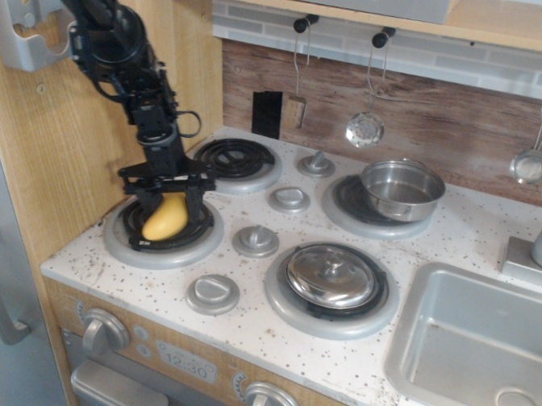
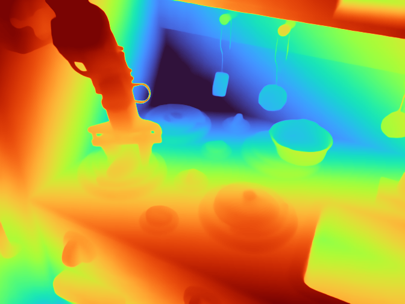
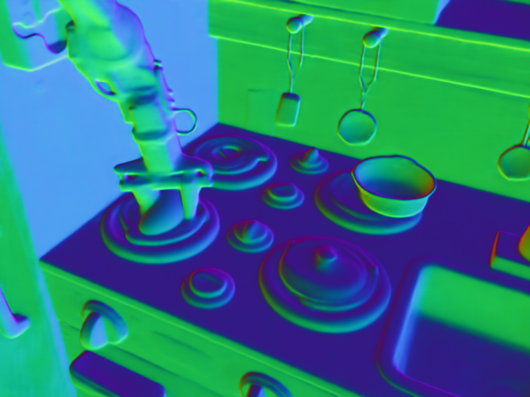
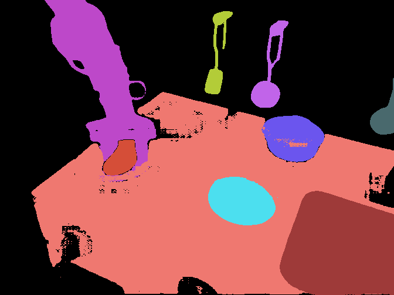
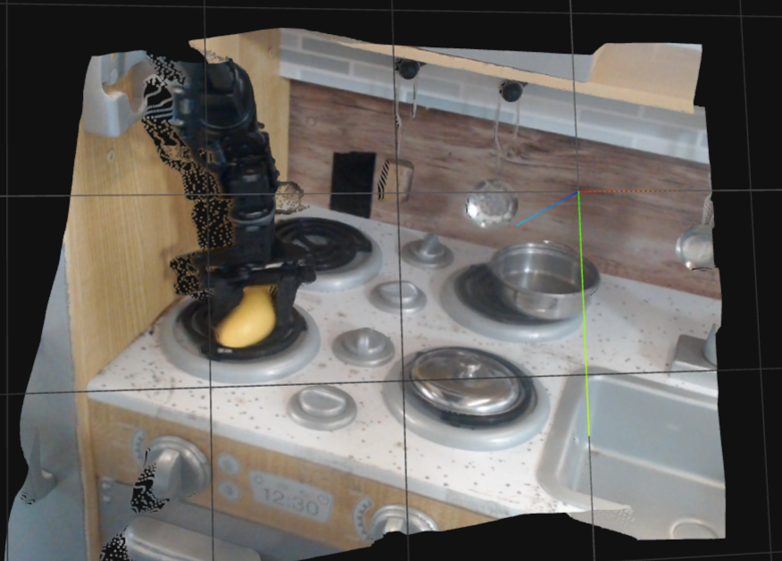
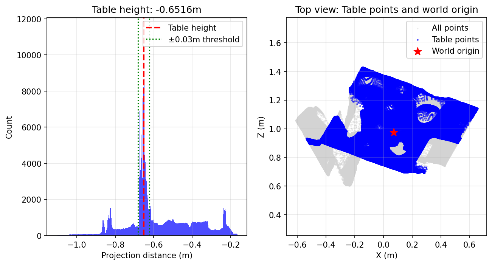
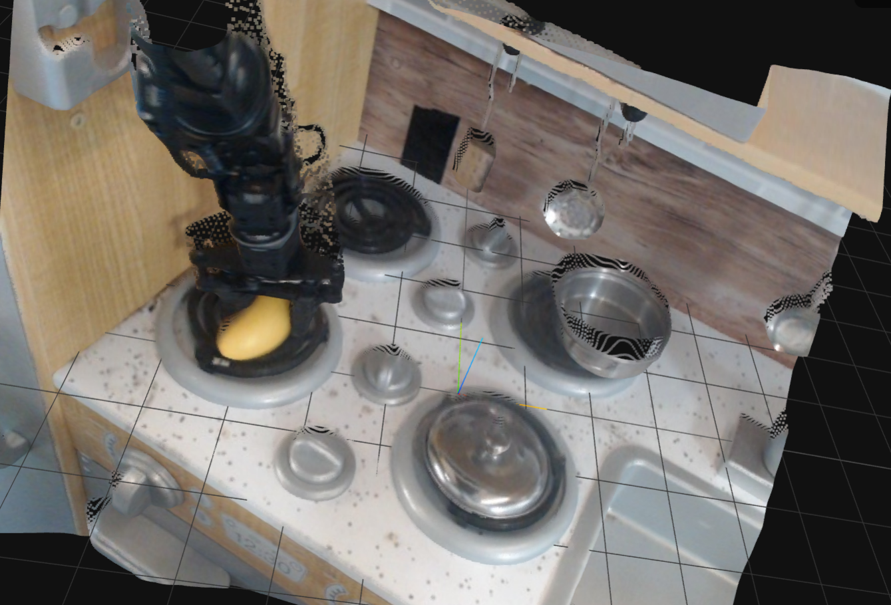
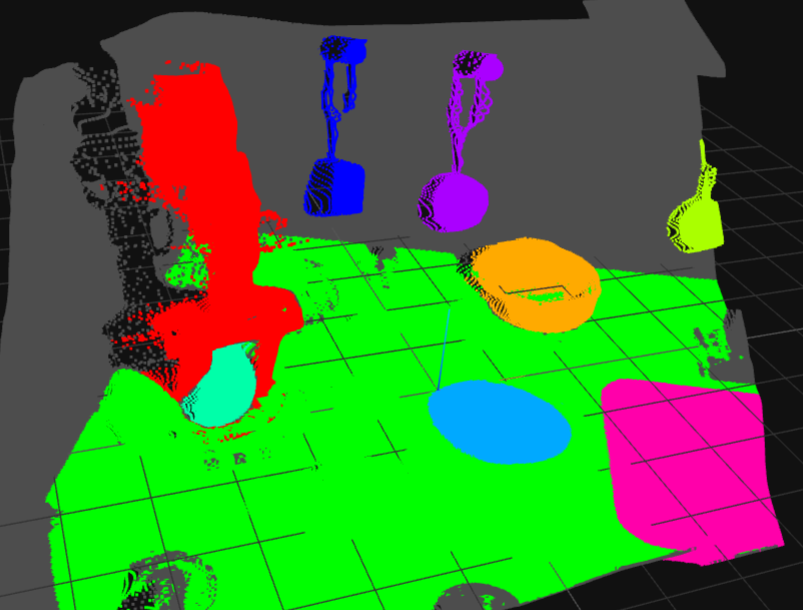
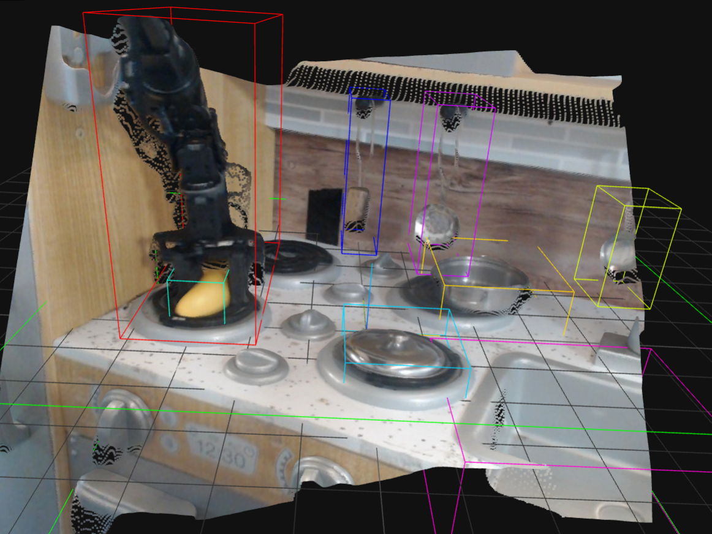

# Embodied-Label

Embodied-Label is a single-image pipeline for semantic instance segmentation and 3D scene structuring.
Given RGB images, it produces semantic tags, 2D masks, depth/normal/intrinsics, labeled point clouds, world-frame transforms, and packaged JSON metadata.

## Project Structure

- `src/step1_resize_images.py`: resize images to width/height multiples.
- `src/step2_generate_tags.py`: semantic tag generation with `qwen` or `ram`, with optional integrated cleaning.
- `src/step3_estimate_geometry.py`: estimate depth/normal/intrinsics (MoGE2 backend).
- `src/step4_segment_2d.py`: Grounded-SAM-2 segmentation.
- `src/step5_backproject_3d.py`: back-project to camera-space labeled point cloud.
- `src/step6_estimate_dominant_normal.py`: dominant normal estimation.
- `src/step7_build_world_frame.py`: build world frame and transform point cloud coordinates.
- `src/step8_package_metadata.py`: metadata packaging.
- `scripts/run_pipeline.bash`: full pipeline entry.
- `scripts/serve_ply_web.py`: web PLY visualizer.
- `scripts/random_pick_first_images.py`: random image/video-frame sampler.

## Setup by Model Dependencies

The environments are separated by model family, not by script file.
The main reason is version conflict in `transformers` between Grounded-SAM-2 and Qwen stacks.

### Dependency split (recommended)

- Grounded-SAM-2 + MoGE2 + 3D processing: `Embodied-Label`
- Qwen tagging / cleaning: `qwen`
- RAM++ tagging: `recognize-anything`

### A. Grounded-SAM-2 + MoGE2 + 3D Runtime (`Embodied-Label`)

Use this environment for:
- step1 resize,
- step3 geometry estimation (MoGE2 backend),
- step4 segmentation,
- step5/6/7/8 3D pipeline,
- web viewer service.

```bash
conda create --name Embodied-Label python=3.10 -y
conda activate Embodied-Label

PROJECT_ROOT="$(pwd)"

# MoGE2 runtime
pip install git+https://github.com/microsoft/MoGe.git
pip install -U "huggingface_hub[cli]"
huggingface-cli download Ruicheng/moge-2-vitl-normal --local-dir models/moge-2-vitl-normal

# Grounded-SAM-2
git clone https://github.com/IDEA-Research/Grounded-SAM-2.git lib/Grounded-SAM-2
cd lib/Grounded-SAM-2
cd checkpoints && bash download_ckpts.sh
cd ../gdino_checkpoints && bash download_ckpts.sh
cd "$PROJECT_ROOT"

mkdir -p models/sam_checkpoints models/gdino_checkpoints
cp -f lib/Grounded-SAM-2/checkpoints/sam2.1_hiera_large.pt models/sam_checkpoints/
cp -f lib/Grounded-SAM-2/gdino_checkpoints/groundingdino_swint_ogc.pth models/gdino_checkpoints/

# Torch + CUDA
pip install torch torchvision torchaudio --index-url https://download.pytorch.org/whl/cu121
conda install -c "nvidia/label/cuda-12.1.1" cuda-toolkit -y

export CUDA_HOME="$CONDA_PREFIX"
export PATH="$CUDA_HOME/bin:$PATH"
export LD_LIBRARY_PATH="$CUDA_HOME/lib:$LD_LIBRARY_PATH"

# Build dependencies
pip install ninja pycocotools wheel packaging setuptools

# Install Grounded-SAM-2 and GroundingDINO extension
pip install -e lib/Grounded-SAM-2
export CC=gcc
export CXX=g++
pip install --no-build-isolation -e lib/Grounded-SAM-2/grounding_dino

# Runtime extras
pip install yapf timm supervision addict open3d
pip install transformers==4.38.2

export PYTHONPATH="$PROJECT_ROOT/lib/Grounded-SAM-2:$PYTHONPATH"
export LD_LIBRARY_PATH="$CONDA_PREFIX/lib/python3.10/site-packages/torch/lib:$LD_LIBRARY_PATH"
```

### B. Qwen Model Runtime (`qwen`)

Use this environment for:
- step2 (`src.step2_generate_tags`) when `--tagger qwen`,
- step2 integrated clean when `--clean-mode qwen`.

```bash
conda create --name qwen python=3.10 -y
conda activate qwen

pip install torch torchvision torchaudio --index-url https://download.pytorch.org/whl/cu121
pip install pillow accelerate qwen-vl-utils
pip install transformers
pip install -U "huggingface_hub[cli]"
huggingface-cli download Qwen/Qwen3-VL-4B-Instruct --local-dir models/Qwen3-VL-4B-Instruct
```

### C. RAM++ Model Runtime (`recognize-anything`, optional)

Use this environment only when step2 runs with `--tagger ram`.

```bash
conda create -n recognize-anything python=3.8 -y
conda activate recognize-anything

git clone https://github.com/xinyu1205/recognize-anything.git
cd recognize-anything
pip install -r requirements.txt -i https://pypi.org/simple/
pip install -e .
cd ..
pip install -U "huggingface_hub[cli]"
huggingface-cli download xinyu1205/recognize-anything-plus-model --local-dir models/recognize-anything-plus-model
```

### Model Placement

```text
models/
├── moge-2-vitl-normal/
│   └── model.pt
├── sam_checkpoints/
│   └── sam2.1_hiera_large.pt
├── gdino_checkpoints/
│   └── groundingdino_swint_ogc.pth
├── Qwen3-VL-4B-Instruct/
└── recognize-anything-plus-model/
    └── ram_plus_swin_large_14m.pth
```

### How model environments map to pipeline variables

- `EL_ENV=Embodied-Label`: core runtime (Grounded-SAM-2 + MoGE2 + 3D stages).
- `TAGS_ENV=qwen`: Qwen runtime for step2 tagging/cleaning.
- `TAGGER=ram` + `RAM_ENV=recognize-anything` (or absolute path): RAM++ runtime for step2.

## One-Command Full Run

```bash
EL_ENV=Embodied-Label \
TAGS_ENV=qwen \
TAGGER=qwen \
QWEN_MODEL_DIR=./models/Qwen3-VL-4B-Instruct \
bash scripts/run_pipeline.bash ./examples demo
```

Output root:

```text
logs/demo_<timestamp>/
  01_resized/
  02_tags/
  03_moge/
  04_seg2d/
  05_backproject/
  06_dominant_normal/
  07_world/
  08_package/
```

## Practical Run Walkthrough (With Figure Slots)

The following walkthrough explains each stage in execution order.
For each stage, you get:
- what the stage does,
- what it reads,
- what it writes,
- what options matter and how to use them.

### Step 1: Resize (`src.step1_resize_images`)

Run:

```bash
python -m src.step1_resize_images \
  --input-dir ./examples \
  --output-dir ./logs/tmp/01_resized \
  --multiple 14
```

What this stage does:
- Resizes all input images so width and height are multiples of `--multiple`.

Input:
- `--input-dir`: folder containing RGB images.

Output:
- Resized images written to `--output-dir`.
- `resize_summary.json` with per-image old/new size and scale.

Important option:
- `--multiple`: use `14` for current pipeline defaults; increase only if you have a strict downstream size constraint.

Example output:
- 


---

### Step 2: Semantic Tagging (`src.step2_generate_tags`)

Run with Qwen:

```bash
python -m src.step2_generate_tags \
  --image-dir ./logs/tmp/01_resized \
  --output-dir ./logs/tmp/02_tags \
  --tagger qwen \
  --qwen-model-dir ./models/Qwen3-VL-4B-Instruct
```

Run with RAM++:

```bash
python -m src.step2_generate_tags \
  --image-dir ./logs/tmp/01_resized \
  --output-dir ./logs/tmp/02_tags \
  --tagger ram \
  --ram-model-path ./models/recognize-anything-plus-model/ram_plus_swin_large_14m.pth
```

What this stage does:
- Predicts object labels per image and builds a global semantic table.
- Optionally runs integrated semantic cleaning/clustering and writes a cleaned table.

Input:
- `--image-dir`: resized image folder.
- Model backend args based on `--tagger`.

Output:
- `tags_per_image.json`: per-image labels.
- `semantic_label_table.json`: global label list with class IDs.
- `class_id_map.json`: label-to-id mapping.
- `semantic_prompt.txt`: merged prompt for grounding stage.
- optional cleaned outputs (when `--clean-output-dir` is set):
  - `tags_per_image.json`
  - `semantic_label_table.json`
  - `class_id_map.json`
  - `semantic_prompt.txt`
  - `clean_report.json`, `alias_to_canonical.json`, `dropped_labels.json`, `canonical_groups.json`

Important options:
- `--tagger`: `qwen` for language-model tagging, `ram` for RAM++ tagging.
- `--qwen-model-dir`: required when `--tagger qwen`.
- `--ram-model-path`: required when `--tagger ram`.
- `--ram-image-size`, `--ram-vit`: tune RAM runtime/performance.
- `--max-new-tokens`: only affects Qwen generation length.
- `--clean-mode`: `off`, `identity`, or `qwen`.
- `--clean-output-dir`: where cleaned label artifacts are written.
- `--clean-model-dir`: model directory used when `--clean-mode qwen` (defaults to `--qwen-model-dir`).
- `--max-images`: debug limit to process only first N images.

Compatibility behavior in the full runner:
- If `TAGGER=ram` and `TAG_CLEAN_MODE=qwen`, the runner automatically executes step2 in two passes:
  1) RAM tagging pass (`--mode full --clean-mode off`) in `RAM_ENV`;
  2) Qwen clean-only pass (`--mode clean_only --clean-mode qwen`) in `TAGS_ENV`.

Example output:

```
{
  "robot arm": 1,
  "towel": 2,
  "sink": 3,
  "stove top": 4,
  "box": 5,
  "can": 6,
  "microwave oven": 7,
  ...
}
```

---

### Step 3: Geometry Estimation (`src.step3_estimate_geometry`)

Run:

```bash
python -m src.step3_estimate_geometry \
  --image-dir ./logs/tmp/01_resized \
  --output-dir ./logs/tmp/03_moge \
  --moge-model-path ./models/moge-2-vitl-normal/model.pt \
  --device cuda
```

What this stage does:
- Predicts depth map, normal map, and camera intrinsics.

Input:
- `--image-dir`: resized image folder.
- `--moge-model-path`: MoGE2 checkpoint path.

Output per image:
- `depth.npy`, `depth.png`
- `normal.npy`, `normal.png`
- `intrinsics.npy`
- `moge_meta.json`

Additional output:
- `step3_index.json`

Important options:
- `--device`: set `cuda` for GPU, `cpu` for fallback.

Example output:



---

### Step 4: 2D Segmentation (`src.step4_segment_2d`)

Run:

```bash
python -m src.step4_segment_2d \
  --image-dir ./logs/tmp/01_resized \
  --semantic-table ./logs/tmp/02_tags/semantic_label_table.json \
  --prompt-path ./logs/tmp/02_tags/semantic_prompt.txt \
  --tags-per-image ./logs/tmp/02_tags/tags_per_image.json \
  --moge-dir ./logs/tmp/03_moge \
  --output-dir ./logs/tmp/04_seg2d \
  --gsam2-root ./lib/Grounded-SAM-2 \
  --sam-config-dir ./lib/Grounded-SAM-2/sam2/configs \
  --sam-config-name sam2.1/sam2.1_hiera_l.yaml \
  --sam-checkpoint ./models/sam_checkpoints/sam2.1_hiera_large.pt \
  --gdino-config ./lib/Grounded-SAM-2/grounding_dino/groundingdino/config/GroundingDINO_SwinT_OGC.py \
  --gdino-checkpoint ./models/gdino_checkpoints/groundingdino_swint_ogc.pth \
  --box-threshold 0.28 \
  --text-threshold 0.28 \
  --mask-source rgb
```

What this stage does:
- Uses GroundingDINO + SAM2 to produce 2D instance masks and labels.

Input:
- images, semantic table, text prompt, optional per-image tags, and Grounded-SAM-2 model paths.

Output per image:
- `grounded_sam2_results.json`
- `instances.json`, `instance_mask.npy`, `instance_mask_viz.png`

Additional output:
- `segmentation_index.json`

Important options:
- `--box-threshold`: lower value gives more candidates, higher value is stricter.
- `--text-threshold`: text matching confidence threshold.
- `--device`: `auto` tries GPU first and falls back to CPU when needed.
- `--tags-per-image`: enables per-image prompt, usually better than a single global prompt.
- `--mask-source`: choose one of `rgb`, `normal`, `crop` for the mask generation branch.
- `--moge-dir`: required when `--mask-source normal`.

Example output:


---

### Step 5: Back-Projection (`src.step5_backproject_3d`)

Run:

```bash
python -m src.step5_backproject_3d \
  --image-dir ./logs/tmp/01_resized \
  --moge-dir ./logs/tmp/03_moge \
  --seg-dir ./logs/tmp/04_seg2d \
  --output-dir ./logs/tmp/05_backproject \
  --downsample-points 0 \
  --edge-filter-thickness 1 \
  --edge-filter-tol 0.04
```

What this stage does:
- Converts depth + intrinsics + 2D instance mask into a labeled 3D point cloud in camera coordinates.

Input:
- resized images, MoGE outputs, segmentation outputs.

Output per image:
- `pointcloud_cam.ply`
- `backproject_meta.json`

Additional output:
- `step5_index.json`

Important options:
- `--downsample-points`: target point count after voxel downsampling; `0` disables downsampling.
- `--edge-filter-thickness`: discontinuity filter size; `0` disables edge filtering.
- `--edge-filter-tol`: tolerance used by edge discontinuity filter.

Example output:


---

### Step 6: Dominant Normal (`src.step6_estimate_dominant_normal`)

Run:

```bash
python -m src.step6_estimate_dominant_normal \
  --backproject-dir ./logs/tmp/05_backproject \
  --output-dir ./logs/tmp/06_dominant_normal \
  --iterations 256 \
  --angle-threshold-deg 5.0
```

What this stage does:
- Estimates the dominant plane normal from 3D normals via RANSAC.

Input:
- camera-space labeled point cloud from step 5.

Output per image:
- `dominant_normal.json`

Additional output:
- `step6_index.json`

Important options:
- `--iterations`: more iterations improve robustness but increase runtime.
- `--angle-threshold-deg`: inlier angular tolerance.

Example output:
```json
{
  "dominant_normal_cam": [-0.021, -0.997, 0.073],
  "inlier_count": 184502,
  "inlier_ratio": 0.72
}
```

---

### Step 7: Build World Frame (`src.step7_build_world_frame`)

Run:

```bash
python -m src.step7_build_world_frame \
  --backproject-dir ./logs/tmp/05_backproject \
  --normal-dir ./logs/tmp/06_dominant_normal \
  --output-dir ./logs/tmp/07_world \
  --n-bins 500 \
  --table-threshold 0.03
```

What this stage does:
- Builds world frame and transforms point cloud from camera frame to world frame.

Input:
- step 5 point clouds and step 6 dominant normals.

Output per image:
- `pointcloud_world.ply`
- `transform_matrix.txt` (4x4)

Additional output:
- `step7_index.json`

Important options:
- `--n-bins`: histogram resolution for plane height peak search.
- `--table-threshold`: table inlier distance threshold in meters.

Example output:





---

### Step 8: JSON Packaging (`src.step8_package_metadata`)

Run:

```bash
python -m src.step8_package_metadata \
  --image-dir ./logs/tmp/01_resized \
  --tags-dir ./logs/tmp/02_tags \
  --tags-clean-dir ./logs/tmp/02_tags \
  --seg-dir ./logs/tmp/04_seg2d \
  --moge-dir ./logs/tmp/03_moge \
  --backproject-dir ./logs/tmp/05_backproject \
  --normal-dir ./logs/tmp/06_dominant_normal \
  --world-dir ./logs/tmp/07_world \
  --output-dir ./logs/tmp/08_package \
  --dataset embodied-label \
  --bbox-mode aabb
```

What this stage does:
- Collects previous stage outputs and exports unified scene metadata JSON.

Input:
- step 1 to step 7 outputs.

Output:
- `scene_package.json`
- `step8_index.json`
- optional per-scene JSONs in `scenes/` when `--split-per-scene`

Important options:
- `--bbox-mode aabb`: axis-aligned boxes, faster.
- `--bbox-mode obb`: PCA-oriented boxes, slower.
- `--split-per-scene`: dumps one JSON file per scene.

## Full Pipeline Environment Variables (Explained)

`scripts/run_pipeline.bash` accepts many env vars.
The key ones and their meanings:

- `EL_ENV`: conda env for core runtime (`Embodied-Label` by default).
- `TAGS_ENV`: conda env for Qwen tagging/cleaning (`qwen` by default).
- `TAGGER`: `qwen` or `ram` for step 2 backend.
- `RAM_ENV`: RAM conda env name/path when `TAGGER=ram`.
- `QWEN_MODEL_DIR`: Qwen model directory used by step2 and default for integrated clean.
- `RAM_MODEL_PATH`: RAM checkpoint path for step 2.
- `MOGE_MODEL_PATH`: MoGE2 checkpoint path.
- `OUT_ROOT`: explicit output root path.

Tag cleaning controls:
- `TAG_CLEAN_MODE`: `off`, `identity`, or `qwen`.
- `TAG_CLEAN_MODEL_DIR`: Qwen model for integrated clean in step2.
- `TAG_CLEAN_MAX_NEW_TOKENS`: generation budget in integrated clean.
- `TAG_CLEAN_TEMPERATURE`: generation temperature in integrated clean.

3D controls:
- `STEP5_DOWNSAMPLE_POINTS`: voxel downsampling target point count.
- `STEP5_EDGE_FILTER_THICKNESS`: edge outlier filter thickness.
- `STEP5_EDGE_FILTER_TOL`: edge filter tolerance.

Step 4 mask branch selector:
- `STEP4_MASK_SOURCE`: `rgb/normal/crop`, default `rgb`.

Packaging controls:
- `STEP8_BBOX_MODE`: `aabb` or `obb`.
- `STEP8_SPLIT_PER_SCENE`: `0/1`.

## Web Visualization (`scripts/serve_ply_web.py`)

Start server on remote machine:

```bash
conda run -n Embodied-Label python scripts/serve_ply_web.py \
  --root-dir ./logs/demo_xxx \
  --host 127.0.0.1 \
  --port 8765
```

Open SSH tunnel on local machine:

```bash
ssh -N -L 18765:127.0.0.1:8765 <your_ssh_host_alias>
```

Open browser:
- `http://127.0.0.1:18765`

Viewer supports:
- original point cloud,
- semantic instance coloring (if instance fields exist),
- 3D AABB overlay (displayed together with original point cloud),
- point size control,
- Z flip,
- coordinate axes display.
